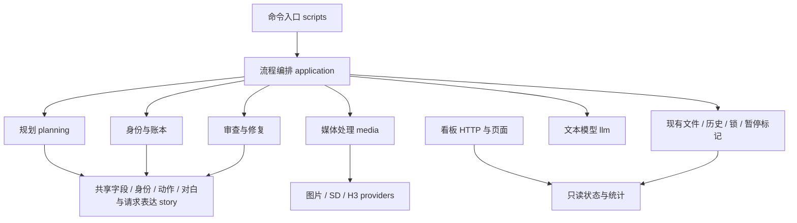

# 当前批量产线架构

正式流程是 production、prepare、repair；统一操作入口为 `scripts/pipeline.py`，看板入口为 `scripts/status_server.py`。scripts 中只保留命令启动文件，参数处理和执行实现在 application；内部辅助模块不再作为旧接口转发。

## 职责与依赖

| 路径 | 唯一职责 |
|---|---|
| `application/planning` | 读书、新书初始化、章节规划调用与流程 |
| `application/identity` | 章节资料、账本读写、实体解析编排 |
| `application/packing` | 加载本集资料、编译及写回片段计划 |
| `application/rendering` | ThinMediaRunner、一次生成执行、报告与后期协调 |
| `application/assets` | 建卡、音色、资产检查等操作工具 |
| `application/review` | 取证、模型审查、复审和补查流程 |
| `application/repair` | 候选准备、派单、历史、发布及管理器 |
| `application/preparation` | 已有剧本的开拍准备、资产与请求检查 |
| `application/production` | 批量调度、进程、统一启动停止和状态 |
| `application/dashboard` | 状态采集、后台刷新和 HTTP 服务 |
| `application/configuration.py`、`profiles.py` | 运行配置组装、路径和小说级策略 |
| `story` | 共享字段、身份、动作、对白、构图、场景解析及中文/H3 表达 |
| `planning` | 请求字段、预算、归一化、原文验证和修订决策 |
| `entities`、`review`、`repair` | 各领域的证据、判定和内存候选；不反向调度 |
| `media` | 资产、生成、缓存、音频、字幕、后期和重试规则 |
| `providers` | 图片/视频请求、任务恢复、下载、H3 实例池 |
| `llm` | 端点配置、HTTP/流式传输、响应解析和结构化请求 |
| `reporting` | 现存记录的用量/费用统计、交付净增口径 |
| `models` | source/bible/dialogue/directing/drama/episode/assets/runtime 数据类型 |
| `dashboard/templates`、`dashboard/static` | 页面模板、CSS、JavaScript |

依赖只向下走：命令 → 应用流程 → 业务服务/共享规则。正式包不得导入 scripts 或 experiments；纯故事规则、规划校验、修复决策不得导入 application；分析和质检不得发起生成或发布。

旧模块的位置映射见 [application-module-map.json](application-module-map.json)。这个文件供维护者定位，不提供兼容导入。

## 修改意见应落到哪里

| 修改 | 位置 |
|---|---|
| 动物/物件/画外目标、自我动作 | `story/fields.py`、`actions.py` |
| 已确认的别名、形态和说话人 | `story/identity.py`、`scene.py`、`dialogue.py` |
| 听者站位、可见说话人分组 | `story/framing.py` |
| 中文切段、片长、参考素材编号 | `story/compilation.py`；输入组装在 `application/packing` |
| H3 声明、对白编号和请求检查 | `story/h3.py`；翻译调用在 `application/rendering/h3.py` |
| 规划字段整理、原文依据、时长 | `planning/normalization.py`、`source_checks.py`、`budget.py` |
| 保留旧片/改分镜/重拍 | `repair/policy.py`；执行与发布在 `application/repair` |
| 音轨识别和文件复用 | `media/analysis.py` |
| 对照当前台词评价识别结果 | `media/speech.py` |
| 字幕分页、时点和后期 | `media/pagination.py`、`subtitles.py`、`postprocess.py` |
| 供应商的画幅和任务协议 | `providers/phanrouter_images.py`、`phanrouter_video.py`、`local_h3.py` |
| 统计及显示 | `reporting` 计算，dashboard 展示结果 |

无对白镜头仍运行 ASR，用于检查意外说话。改变提示词效果或检测策略必须作为行为变更评审，不能因整理目录而跳过检查。

## 配置的来源

| 来源 | 提供什么 | 保留的优先关系 |
|---|---|---|
| `configs/pipeline.json` | 小说名单、标题/显示顺序、章节范围、规划与视频资源、准备/修复默认参数 | 小说配置覆盖相应 defaults；资源名引用同一 resources |
| `outputs/<novel>/profile.json` | 画风、画幅、tier、小说级质检选择 | 已有显式 CLI 覆盖值优先于 profile，再使用原默认值 |
| 已保存 clip_plan | 重新打包时的画幅、tier、片段长度 | 继续优先使用该计划记录的限制 |
| 环境变量和 `.env` | 端点、凭据变量名、服务连接及环境选项 | 已有环境优先于 `.env` 补充值；各流程原有强制通道选项保留 |
| repair_manager 的 scope | 指定章节的语音门等已有修复范围 | 原范围内覆盖小说策略；范围外沿用 profile |
| `NOVEL_PROJECT_ROOT`、运行路径 | 安装包要操作的项目目录；未指定时源码工作树默认根目录 | 显式目录优先；不把安装位置当作产物目录 |

准备队列为每个子进程构造独立环境；单章命令在自己的进程内初始化该通道。翻译、审查模块的导入不会改全局模型环境。
运行配置对象保留当前生效参数；本轮没有调高并发、改变预算或恢复诸天。

## 产物与写入所有者

| 现有产物 | 谁负责 |
|---|---|
| novel、story_bible、章节原文 | 新书初始化和原有读书流程 |
| chapter_script、source/identity 证据 | 规划及身份流程；修复仅发布通过检查的候选 |
| clip_plan、pack_decisions | 打包应用流程；保留原文地址、片段编号与拆分映射 |
| request、task sidecar、ASR 与片段素材 | 对应的生成/供应商/分析步骤，保持原路径 |
| thin_media_report、成片候选 | 渲染编排；先写报告，再记录实际生成历史 |
| repair_history、路由、预算 | 修复编排；缓存复用不计新生成，真实生成即使拒收仍计用量 |
| 最终发布文件 | 原发布步骤，检查通过后替换；候选失败不发布 |
| 状态、暂停标记、锁 | 原控制器；状态查询不推进任务 |
| 看板历史缓存与净增样本 | 看板后台采集；不代替生产状态 |

没有新增持久化剧本格式、队列或数据库，没有迁移/清空旧视频、缓存、预算和任务记录。

## 用量与交付含义

交付判定仍来自当前成片、技术结果和当前片段审查。净增交付使用已有采样，重合成次数不等于净新增交付。

用量按现有素材、供应商任务和修复历史统计，按已有任务 ID/素材版本去重。当前所选素材时长、可追溯生成时长和最终成片时长分别展示。
本地 H3 不套付费 SD 单价；本地算力成本未统计。缺失 token、分辨率、价格和历史记录会明确显示，只有请求时长的记录也单列覆盖数量。这是可追溯用量统计，不是服务商完整账单。

## 历史代码与验证

旧生成 HTTP/CLI 入口已退出。旧整集实验、专用资产工厂/评估、32 个实验类型在 experiments/legacy；批量字幕仍使用的分页能力保留为正式共享模块。
当前 EpisodePlan 字段引用的 drama 类型，以及历史视频诊断工具使用的 runtime 类型继续保留。已完成的旧 shell 接管逻辑只在实验回放中保留；正式管理器退休 preview/--adopt-legacy，历史任务读取不变。

回归入口见 [测试说明](../tests/README.md)。本轮范围和证据见 [完整计划](full-refactor-plan-20260917.md) 与 [实施记录](full-refactor-progress-20260917.md)。日期文档是当时记录，本文件为当前架构说明。
