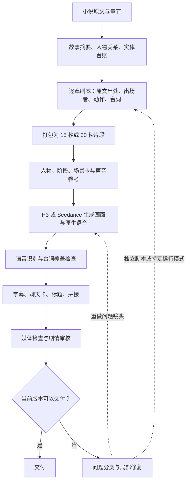

**当前流程审查与竞品调研 · 2026-09-14**

结论（按用户随后明确的批量生产目标修订）：保留现有长篇规划、资产管理、批处理和 H3/SD 后端；优先补齐生成前的自动叙事与场景检查，以及审核结果到局部修复的自动闭环。逐镜人工操作的制作工作台不作为改造目标。竞品的参考价值主要在结构化输入、资产引用和局部任务管理；现有资料不足以证明某个竞品能以同等质量、更低成本完成本项目规模的长篇批量生产。

进一步阅读实际提示词后，确认借鉴价值还包括故事骨架、改编策略、按叙事转折分段和自动导演分场，不能只归结为接口小功能。详细对照及当前提示词预算冲突见 [小说解读与提示词流程对照](/mnt/disk1/zengzhitao/novel-manga-video/docs/prompt-workflow-comparison-20260914.md)。

本次检查的是 `feat/fast-tier` 的当前工作树（HEAD `8c8d94c`，含已有未提交修改），并读取生产文件、进程和官方产品资料。统计快照时间为北京时间 **2026-09-14 11:54**；生产文件在持续变化，逐文件扫描不代表同一瞬间的事务快照。未启动付费生成，未改动生产任务，未修改实现代码。本文包含确定缺陷、运行状态差异和设计建议，三者分开说明。

**一、当前流程与实际状态**

已有的原文追踪、角色检查、片段打包、有限重试和媒体门应继续保留。当前主线依赖模型原生音画；若增加有声动态漫画路线，需要独立配音能力，不能先生成完整视频再抽取声音，随后把省掉的画面算成生成成本节约。

| 小说 | 扫描到的片段计划数 | 媒体状态为 done | 计划或输入已变更，成片过期 | 已有实体台账章节 | 当前审核规则的报告数量 |
|---|---:|---:|---:|---:|---:|
| 星海龙途 | 1,600 | 1,007 | 0 | 0 | 0；现有 1,600 份仍是 v1.16 |
| 雾月秘典 | 2,043 | 1,492 | 435 | 2,043 | 1,591；另有 452 份 v1.16 |
| 诸天万象录 | 3,838 | 992 | 30 | 0 | 0；发现 1,930 份 v1.16 |

`done` 是当前代码计算的媒体状态，**不等于当前剧情审核通过，更不等于可交付**。审核报告采用 v1.17，也不代表报告结论为通过。上表使用当前 H3 目标路线读取媒体状态；没有把旧 delivery 汇总中的数字直接作为交付数。

运行状态也要分开看：《雾月》《诸天》的统一配置都是 `plan_only: true`，但核对进程时，《雾月》仍有两批 `--stage render --parallel 12` 任务及其子进程，另有一批只审核任务。统一配置描述调度器接下来如何派活，不能据此断言独立启动或先前启动的任务已经停止。`parallel 12` 是批处理参数，不是 12 个 GPU 任务正在推理的证明。

本次原始统计保存在 [snapshot.json](/mnt/disk1/zengzhitao/tmp/novel-flow-review-20260914/snapshot.json)，包含 321 个无法匹配当前车道的章节清单和语音门反例。统计期间已有其他任务更新计划与审核结果，后续看板数字会继续变化。

**二、确定存在的流程缺陷**

**1. 星海存在 321 集非 done 的 30 秒计划，当前配置没有可承接它们的车道；配置检查仍通过。**

星海只启用 `h3pool`，其 `clip_cap` 为 15；章节 1–480、801–1200、1201–1600 仍声明为 30 秒档。配置校验只问“每条车道是否至少有一个匹配区段”，没有反向检查“待处理区段是否都有匹配车道”。调度器又要求 `plan_mode == clip_cap`，因此这些旧计划不会因为 H3 空闲而自动变成可渲染任务。现场执行 `pipeline.py validate` 的结果确实是“配置检查：通过”。

证据：[pipeline.py:83](/mnt/disk1/zengzhitao/novel-manga-video/scripts/pipeline.py:83)、[conductor_thin.py:321](/mnt/disk1/zengzhitao/novel-manga-video/scripts/conductor_thin.py:321)、[pipeline.json:157](/mnt/disk1/zengzhitao/novel-manga-video/configs/pipeline.json:157)。这里的 321 是“已有计划且媒体状态不是 done”，包含待生成及有警告的状态，不代表 321 集都没有视频文件。

修法：让校验明确列出没有车道的待处理区段；为这些章节选择保留 30 秒后端，或有范围地转换为 15 秒计划。转换要保留原文、镜头边界和已选素材的关系，不能只改配置数字，也不应默认全书重生成。

**2. 语音覆盖门能放过关键意思反转。**

当前使用最长公共子序列的字符覆盖率，缺失比例严格大于 0.5 才失败。直接调用现有函数得到：

| 预期台词 | 识别台词 | 缺失比例 | 当前覆盖门 |
|---|---|---:|---|
| 不要开门 | 开门 | 0.5 | 放行 |
| 不能相信他 | 相信他 | 0.4 | 放行 |

这是对判断函数的确定性反例，**不是声称已经在某集音轨里听到了这两句错误**。后面的剧情审核可能发现部分错误，但该语音门自身无法保证关键台词语义正确。证据：[render_clips_thin.py:230](/mnt/disk1/zengzhitao/novel-manga-video/scripts/render_clips_thin.py:230)、[render_clips_thin.py:1197](/mnt/disk1/zengzhitao/novel-manga-video/scripts/render_clips_thin.py:1197)。

修法：为关键台词单独保留否定词、人物名、关键关系和事件结果的检查；音效、语气词与对白分开处理。不要仅靠降低全局缺失阈值，否则会重新放大短句、拟声词的 ASR 误报。

**3. 聊天卡按整个片段插到开头，会改变原有叙事顺序。**

`story_segments()` 先加入一个 clip 的全部 `chat_segments`，随后才加入整个视频。现场已有《诸天》923 章 `clip_03`：剧本先安排人物自言自语，再发消息，再抱怨对方没有回复；聊天卡统一前置后，顺序发生变化。《诸天》1033 章也有口头对白和聊天共同打包的片段。这个问题与生成后端无关。

证据：[render_clips_thin.py:1721](/mnt/disk1/zengzhitao/novel-manga-video/scripts/render_clips_thin.py:1721)、[923 章剧本](/mnt/disk1/zengzhitao/novel-manga-video/outputs/zhutian-card/zhutian-card_923/chapter_script.json)、[923 章片段计划](/mnt/disk1/zengzhitao/novel-manga-video/outputs/zhutian-card/zhutian-card_923/clip_plan.json)。

修法：将聊天发生的位置作为明确的阶段边界，按原始阶段顺序组装。新计划可在聊天处拆开视频片段；旧素材只有在有可靠时间定位时才切开插卡。这里不适合靠修改提示词掩盖组装错误。

**三、还未闭合的生产环节**

**实体台账方向正确，但还不是三本书统一具备的输入。** 雾月已有 2,043 章台账，另两本未发现对应章节文件。调度器的故事预读进度仍由 `bible_growth.json` 最大章节号决定，不等价于台账与章节摘要都已准备好。新规划代码对缺少台账的章节仍可回退到旧的人名识别方式。因此“新规划规则已加入代码”不能直接推导成“全部生产都受新规则保护”。证据：[conductor_thin.py:251](/mnt/disk1/zengzhitao/novel-manga-video/scripts/conductor_thin.py:251)、[plan_chapter_thin.py:440](/mnt/disk1/zengzhitao/novel-manga-video/scripts/plan_chapter_thin.py:440)。

另一个值得用真实章节验证的设计风险：规划提示把每段 `named_here` 当作入镜名单，而该名单仍依赖段落中是否出现名字。人物在上一段已经入场、下一段只用“他”延续动作时，需要连续场景状态补充判断。此项是代码结构暴露的风险，本次没有把它统计成已确认错片数量。

**生成前有检查，但缺少统一的叙事和场景放行环节。** 当前并非毫无前置检查：已有出处、角色和打包约束。缺的是对“谁在场、动作作用于谁、在哪里、事件先后、下一镜承接什么”的联合确认，以及关键帧/粗剪预览。例如旧《诸天》923 章存量剧本出现 `location` 标成巷子而画面要求躺在床上的矛盾。这类问题无需先花视频生成成本才能识别。该例反映现存计划质量，不代表最新规划器仍必然生成同样错误。

**审核能发现问题，不代表常规调度已自动完成修复。** conductor 启动的是 `--review-only --no-render`；批处理自动修复仅在 `--unattended` 等指定路径启用，另有独立修复脚本。控制付费重试次数是合理的，但看板应区分“已审出”“已批准修复”“已更新计划”“正在重生成”“复审通过”。证据：[conductor_thin.py:585](/mnt/disk1/zengzhitao/novel-manga-video/scripts/conductor_thin.py:585)、[thin_batch.py:630](/mnt/disk1/zengzhitao/novel-manga-video/scripts/thin_batch.py:630)。

**代码、运行进程、旧成片和旧审核报告是不同版本。** 当前工作树已统一新的审核规则判断，但星海、诸天的历史审核文件仍大量停留在 v1.16。修代码不会自动重写旧计划、替换旧视频或重新判定旧报告；长驻 Python 进程也不会因磁盘源码变化而自动重载。看板应同时展示当前输入与成片是否一致、审核规则版本、任务实际来源，避免把“有旧成片”显示成“已按最新规则交付”。本次没有断言每个存量进程都未加载修复，也没有执行重启或历史回填。

**四、竞品对照：优先借鉴什么**

以下是官方公开能力与许可说明的核对，未购买账号或做同题实测。“支持”表示官方文档列出能力，不代表本项目规模下的质量、稳定性与速度已经验证。

| 产品/项目 | 官方展示的制作方式 | 对本项目最有用的参考 | 使用边界 |
|---|---|---|---|
| **Toonflow** | 导入小说、提取章节事件、改编剧本，在画布上组织角色、分镜和视频节点 | 原文到事件再到分镜的可编辑链路；适合参考小说改编工作台 | 没有公开的同题大批量基准；作者另列商业补充条件。[官方仓库](https://github.com/HBAI-Ltd/Toonflow-app) |
| **火宝短剧 Huobao Drama** | 小说转拍摄脚本、提取角色/场景/道具、逐镜编辑、生成、选择片段导出 | 单镜头提示词修改、资产引用、按模型能力选择时长、批量提交前显示总时长 | CC BY-NC-SA 4.0，作者要求商业使用另获授权；不能按宽松商用代码直接集成。[官方说明](https://github.com/chatfire-AI/huobao-drama/blob/master/README.zh-CN.md) |
| **LTX Studio** | 持久角色/地点/物件 Elements、故事板、镜头编辑与时间线 | 先确认场景和镜头，再局部修改；把角色资产贯穿制作过程 | 面向制作工作台；不能从订阅积分直接换算本项目每集成本。[官方产品页](https://ltx.io/studio) |
| **Mootion** | 可拆分、合并、添加、删除故事板场景，并配置对白、镜头、时长 | 用声音组织叙事，再逐场景表达；可参考低视频用量路线 | 有 API 页面和文档入口，本次未核验 API 价格和账号并发。[官方 FAQ](https://www.mootion.com/docs/faq.html)、[API](https://www.mootion.com/api.html) |
| **Medeo** | 脚本/提示转故事板，编辑场景和镜头，再生成视频 | 编辑现有作品、替换局部内容的交互；区分全生成与素材路线 | 定价页对 Full AI Video 与 Stock Video 给出不同容量；不能把素材视频产量当成全生成产量。[故事板产品页](https://www.medeo.app/features/ai-storyboard-generator)、[定价](https://www.medeo.app/pricing) |
| **Vidu Q3 Turbo API** | 参考图生成同步音视频，支持多图输入 | 新的视频后端候选，适合与 H3 做同镜头对照 | 属于生成接口，不能替代小说台账、改编、组装与交付审核。[参考生视频接口](https://platform.vidu.com/docs/reference-to-video) |

Toonflow 作者展示过约 2 分钟成片、约 3 分钟生成素材、约 2 小时制作、约 130 元总成本的案例。这是作者给定案例的自报结果，包含不同模型与人工工作方式，不能与本项目无人值守任务的吞吐直接相比。[官方案例说明](https://github.com/HBAI-Ltd/Toonflow-app)

Toonflow 仓库同时给出 Apache 2.0 文本与补充商业条款，列举内部使用、制作内容获利等免费情形，也对面向多个独立第三方分发产品另提授权要求。若参考实现，需要按实际使用方式核对完整条款；本文不把它归为“无额外条件的 Apache 项目”。[LICENSE](https://github.com/HBAI-Ltd/Toonflow-app/blob/master/LICENSE)

订阅价格仅作为采购入口参考：LTX Standard 页面列月付 35 美元、28,000 credits；Mootion Standard 列月付 15 美元、1,500 credits。这些积分的消费规则不同，不能按积分数比较便宜程度，也不能据此承诺每月多少合格小说集。[LTX 定价](https://ltx.io/studio/pricing)、[Mootion 定价](https://www.mootion.com/pricing.html)

纳米大片流水线也列入观察名单，但本次官方入口未返回可核验的产品参数、价格和 API 文档，因此不采用网上“一集几十分钟”“一致性百分比”等数字参与排名。[官方入口](https://www.namistory.com/)

**五、值得测试的 fast API：Vidu Q3 Turbo**

官方参考生视频文档列出 `viduq3-turbo`，支持 1–7 张参考图、3–16 秒视频及 540p/720p/1080p 输出，并支持同步音视频。参考图和同步声音不等于已经证实支持本项目所需的多角色声音克隆；该项必须单独验证。[参考生视频文档](https://platform.vidu.com/docs/reference-to-video)

按官方参考生视频的常规单价计算：

| 分辨率 | 美元/生成秒 | 15 秒素材 |
|---|---:|---:|
| 540p | 0.02 | 0.30 美元 |
| 720p | 0.05 | 0.75 美元 |
| 1080p | 0.065 | 0.975 美元 |

这是生成素材的标价换算，未计重试、无效素材、剪辑、配图或其他费用，不是合格成片报价。价格页另有错峰价格，排队与交付时延需要实测。[官方价格表](https://platform.vidu.com/docs/pricing)

官方限制按**组织**计算，默认并发为 5，超过并发的任务排队；系统负载也可能影响实际并发。增加同组织 API key 或换 IP，不能据此推导出配额增加。文档中的示意完成时间不能当作测速结果。[用量与限制](https://platform.vidu.com/docs/usage-and-limits)

目前应把 Vidu 排在“值得接入的小样本候选”，不能宣布它比 H3 快几倍或便宜多少。H3 的 GPU 占用、摊销/租金和失败重做也必须计成本；此前 SD 的渠道额度估算不能当作已经核对过的现金账单。

**六、建议采用的流程改造顺序**

| 顺序 | 改动 | 验收方式 |
|---|---|---|
| 1 | 补路由覆盖校验、修聊天阶段顺序、补关键台词判断 | 没有车道的待处理章节被明确列出；聊天前后的对白顺序保持；语义反转反例不会仅凭字符覆盖放行 |
| 2 | 将实体、在场状态、动作对象、场景和事件顺序连成生成前检查 | 床/巷子等结构冲突能在视频请求前指出；人物只被提及或只发声时不自动入镜 |
| 3 | 将原文、阶段、片段、资产和当前 take 的关联接入自动修复 | 审核结果能直接定位需修改的阶段与受影响片段；其他已合格素材保留 |
| 4 | 按错误类型连接局部修复 | 别字/字幕问题不重做视频；组装问题只重剪；动作/人物错误才重生成；超过预算后等待处理 |
| 5 | 比较 H3、Vidu 与混合路线 | 用同一原文、镜头设计、画风资产和验收口径测合格成片分钟/小时、成本/合格分钟和人工修改时间 |

前端维持生产看板定位，展示可交付产量、异常类别、任务是否自动修复及少量无法自动处理的问题。生成与修复流程不等待画布操作、人工选择 take 或逐镜确认。先连接现有 JSON、修复脚本和调度器；不需要为了画布重写后端。关键帧检查应只在能降低预期返工成本的场景自动触发；正式作品继续使用清楚的连续画面。

两条提速路线可共用台账、章节剧本、角色资产和镜头顺序：

- **关键镜头混合版**：先锁定独立配音与叙事时间线，普通段落使用有表情变化的画面及镜头运动，高潮/动作段生成动态视频。每集仅让约 20–30 秒真正动态是待测试的内容预算，不是已验证的质量或速度承诺。
- **有声动态漫画版**：用配音推动完整剧情，按对白、反应、行动结果切镜，以有限动画表达。不能用随机切块代替人物行动，也不能省掉交代因果关系的镜头。

如果生成视频是瓶颈，减少视频生成秒数会降低该部分工作量；总时延仍受配音、配图、审核与返工影响，无法直接按动态秒数比例宣称全流程提速。跨镜头连续动作可让后一镜参考前一镜的确认结果；独立场景仍并行，避免把整章改成串行生成。

**七、最小对照实验设计（本次未执行）**

从已被人工确认没有问题的现有章节中选 10–12 个镜头，覆盖双人对白、多人场景、否定台词、变身/身体状态、动作衔接和聊天插卡；再选一段完整连续剧情用于最终观看。各视频后端使用相同原文、角色/场景资产、目标时长和画幅，单镜头各做两次。遇到模型不支持的声音参考等能力应记录差异，不能偷偷用额外后期补齐后当作直接公平对照。

分两层验收：单镜头看人物/台词/动作是否正确；完整段落看观众能否复述“谁做了什么、为什么、结果如何”。计入失败尝试、排队时间、审核时间和人工修正；分别报告 API 请求耗时与从开始到合格成片的时间。与全生成版比较时，混合版保留同一剧情的信息点，只改变画面实现方式。

有效产能应使用 **当前规则下可交付的成片分钟 / 总耗时**，并列出重做率和人工分钟。原始素材时长、文件数量、旧规则下的通过率都不能单独代表有效产能。

**八、开源实现对照：按无人值守批量生产取舍**

补充检查固定在 Toonflow `e03cf590eb0cab63534a4040db9acb4ec95b42a6`、火宝 `ff9b046f8950e16e131aa13b016c11269d9ed6ca`。仅阅读源码，没有启动它们的服务。LTX Studio、Mootion 的内部实现不在这次源码比较范围内。

| 能力 | 开源实现中确认的机制 | 我们已有基础与应借鉴的部分 |
|---|---|---|
| 事件与分镜 | Toonflow 按章节生成事件并记录状态；制作数据含剧本、拍摄计划、资产和分镜列表 | 已有章节原文、摘要、台账和结构化阶段；应强化自动检查事件因果、动作主体及场景连续性 |
| 持久资产 | Toonflow 分镜关联资产 ID，资产可有衍生形态；火宝使用剧集、角色、场景、分镜关联表 | 已有 `series_assets`、角色阶段卡和片段 reference；无需因为竞品有资产库而重新实现一套 |
| 局部更新 | 火宝分镜工具按镜头编号更新或插入，绑定角色与道具；也有清空旧分镜的显式模式 | 已有 `origin_index`、`shot_parts` 和局部重建函数；自动重试应使用局部更新，避免全章重排使成功素材失配 |
| 批量视频 | Toonflow 批量接口持久化视频记录并发起后台生成；火宝创建 `sys_task` 并轮询生成结果 | 保留我们的模型池调度、断点续跑和重试上限；不要仅为复制“批量按钮”另建执行系统 |
| 自动验收 | 检查到的 Toonflow 完成路径在视频保存后标记生成成功；火宝下载视频并提取海报后标记任务完成 | 这些完成状态不能替代我们对台词、媒体、原文剧情与交付的检查；未据此断言仓库所有路径都没有其他审核 |

源码依据：[Toonflow 章节事件](https://github.com/HBAI-Ltd/Toonflow-app/blob/e03cf590eb0cab63534a4040db9acb4ec95b42a6/src/routes/novel/event/generateEvents.ts)、[制作数据与 Agent 工具](https://github.com/HBAI-Ltd/Toonflow-app/blob/e03cf590eb0cab63534a4040db9acb4ec95b42a6/src/agents/productionAgent/tools.ts)、[批量视频入口](https://github.com/HBAI-Ltd/Toonflow-app/blob/e03cf590eb0cab63534a4040db9acb4ec95b42a6/src/routes/production/workbench/batchGenerateVideo.ts)、[火宝数据模型](https://github.com/chatfire-AI/huobao-drama/blob/ff9b046f8950e16e131aa13b016c11269d9ed6ca/backend/src/db/sqlite-schema.ts)、[分镜写入工具](https://github.com/chatfire-AI/huobao-drama/blob/ff9b046f8950e16e131aa13b016c11269d9ed6ca/backend/src/agents/tools/storyboard-tools.ts)、[生成任务服务](https://github.com/chatfire-AI/huobao-drama/blob/ff9b046f8950e16e131aa13b016c11269d9ed6ca/backend/src/services/generation.ts)。

两个具体边界：火宝 `batchVideos`、`retryFailedVideos` 先打开前端确认，再逐镜调用生成；Toonflow 的 `get_flowData`、部分生成工具通过 socket 向画布端取数据或触发动作并等待回应。这些被检查的路径依赖交互会话，不能直接拿来替代现有无界面整书生产调度。[火宝批量调用](https://github.com/chatfire-AI/huobao-drama/blob/ff9b046f8950e16e131aa13b016c11269d9ed6ca/frontend/app/views/drama/episode.vue#L2140)、[Toonflow 工具调用](https://github.com/HBAI-Ltd/Toonflow-app/blob/e03cf590eb0cab63534a4040db9acb4ec95b42a6/src/agents/productionAgent/tools.ts#L90)。

适合本项目的自动循环是：生成计划 → 自动检查 → 定向修正计划 → 生成 → 自动审核 → 按错误类型修字幕、重剪或重做局部片段 → 复审 → 交付。达到预算上限的问题集隔离，继续不依赖它的任务。人工主要处理共性规则、异常聚类和验收抽样，不能成为每集必经环节。只有语音误识别、组装错误、人物/动作错误等分类足够可靠，自动修复才能避免反复消耗算力。

本次完成了源码和生产文件审查、配置校验、语音判断函数反例、公开竞品能力与价格核验及两套开源实现的定点阅读；没有进行竞品生成实测、自动回填、进程重启、提交或推送。修改仅涉及本报告，其他已有工作树修改保持原状。
