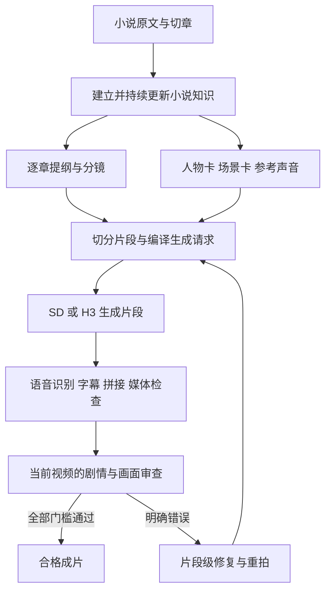
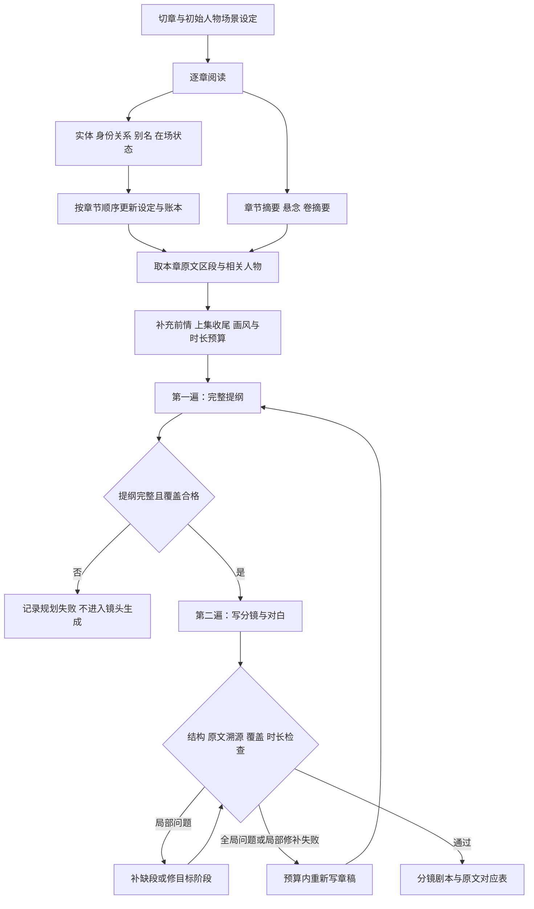
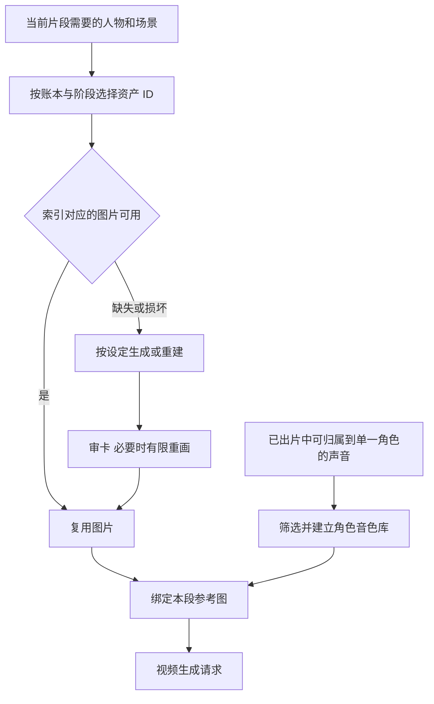
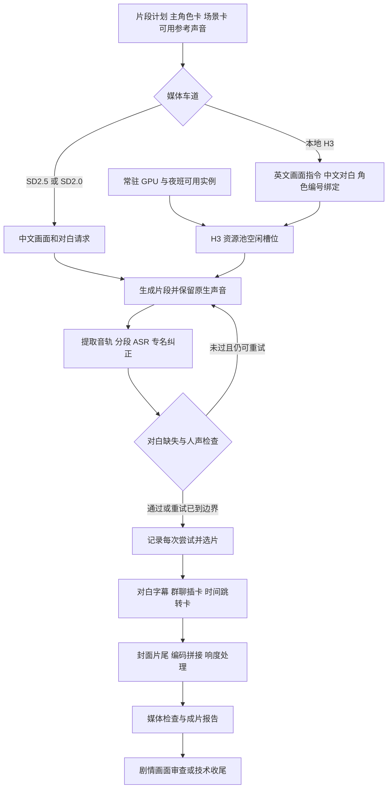
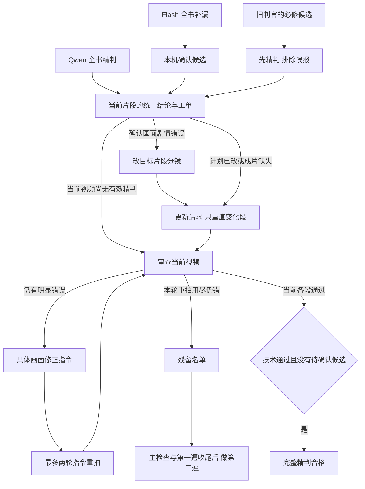

# 项目流程地图

核对时间：2026-09-14 23:52–23:56。以 `feat/fast-tier` 当前工作树代码为准，包括尚未提交的修复；运行状态是检查时的快照。

项目主生产线以小说目录中的 JSON 计划、账本、任务记录和媒体缓存交接工作。资产索引是其中一部分，不承担整个生产调度。

## 总览

SD2.5、SD2.0 和 H3 是媒体后端选择，前面的原文理解、分镜、资产与后面的拼接审查大量共用。`fast` 是生产档位，不是单独的视频模型。

## 小说理解与规划

- 读书的模型扫描可以并行，人物设定和实体归并按章顺序提交；规划按块并行、块内有连续性上下文。
- 当前规划代码先生成明确的完整提纲，再将全文传给第二遍。默认提纲为 `coverage`；强调目标、因果和分场的 `story` 提纲仍是实验选项。旧文档“一章一次调用”不能描述当前实现。
- 第一遍不能用被截断的推理尾巴充当提纲。第二遍的局部修补和整章重试均有预算，失败保留记录，不送入出片。
- 分镜包含原文引用、人物、动作、画面、机位、光线、对白、结束状态等。打包器按演员、场景、时长和阶段数切片，超长对白按顺序拆开；短片只在不突破约束时合并。
- `shot_parts` 记录一段原始分镜分到了哪条短片。存量修复优先保持原片段 ID 和切分，不能可靠还原的保留并报告，不自动整集重规划。

## 资产与参考声音

资产定位依赖 `series_assets/manifest.json`、角色/场景 ID、阶段设定和文件路径。先决定本章真正使用哪个人物形态，再查具体图片；不会为了找几张卡解码全书图片。

当前 fast 生产只使用主角色卡，不制作或复用表情卡。资产缺失才生成，坏图才重建；仍保留建卡审查。参考声音从已有成片提取，并非逐句 TTS 覆盖主线视频配音；材料不足的角色不强行建立音色样本。

## 请求、视频和合成

- 是否重新生成取决于实际请求、参考资产、选中视频和缓存状态。只改几段就优先重渲几段，其余片段复用；成片需要重新拼接。
- 当前雾月使用 H3、fast、15 秒片段配置、3D 横屏；旧章节来自不同历史版本，不能假设所有存量内容都经过今天的规划器。
- H3 资源池从常驻配置及夜班租用状态取实例，按可用槽位分配；夜班到期前停止接新任务并退出。机器租用生命周期由相邻 `h3-night-shift` 项目管理，视频项目消费可用资源。
- 群聊消息由程序绘制插卡，不要求视频模型生成可读聊天文字。
- fast 的片段语音失败可有限重试；免费本地车道后续可对失败缓存申请新拍摄，但仍受每个计划的运行次数限制。付费车道不会无条件循环购买重拍。
- 雾月配置豁免的是整集媒体 QC 的 `silence_ratio` 和 `long_silence`。片段有预期对白时，`voice_energy_missing` 与漏读检查仍在。成片有文件、技术合格、剧情合格是不同状态。

## 当前雾月修复闭环

图中的重拍循环受轮次限制。每一遍默认先修分镜，再最多两轮带指令重拍；第二遍后仍错的留在残留名单，不自动放行。明确黑屏等技术错误直接保留必修，无需用剧情判官反复证明。

精判使用当前视频抽帧、原文和账本上下文。新视频不能继承旧视频的通过结论；当前视频已经有有效结论则复用，避免每轮全量重判。Flash 可跨轮继续，第二遍不等待 Flash 全书扫描结束。

工单内容包括章节/片段号、当前选中视频、原文区段、账本/分镜、错误证据及修正指令。它首先按“需要修段、补渲、补审、确认候选”分流；按语义原因自动决定“改分镜还是直接重拍”的策略尚未接入生产。

## 调度、状态和看板

| 范围 | 实际入口或执行者 | 作用与边界 |
|---|---|---|
| 新书生产管理 | `scripts/pipeline.py` → `conductor_thin.py` | 按小说配置管理读书、规划、建卡、生成车道和普通审查 |
| 雾月存量修复管理 | `scripts/manage_repair_thin.py` | 统一工单、阶段、归属、轮次、恢复运行和暂停新调度 |
| 一批具体任务 | `scripts/thin_batch.py` | 执行规划/建卡/渲染，检查缓存、锁和重试额度 |
| 修段执行 | `scripts/repair_clips_thin.py` | 只改选中的错误片段，保存源分镜对应关系 |
| 历史切分恢复 | `scripts/repair_split_ranges.py` | 生成前按既有记录恢复可还原的对白范围 |
| 复审与证据归并 | `scripts/repair_review_thin.py` | 统一当前 take 的精判结论、复用记录、处理 Flash 确认 |
| GPU 分配 | `src/novel_manga/providers/h3_pool.py` | 跨渲染进程共享可用槽位；夜班租用属于外部资源管理 |
| 原交付汇总 | `scripts/delivery_gate_thin.py` | 定期从成片和审查结果写 `delivery.json` |
| 前端看板 | `scripts/status_server.py` | 读取日志、成片和交付报告展示，当前页面是只读的 |
| 使用量/成本 | `scripts/cost_report_thin.py` 等 | 汇总生成任务和用量记录；不承担实际视频调度 |

9 月 15 日更新后的雾月修复配置：每集独立推进；修复最多 24 集可执行在途；补渲生成最多 12 集、生成与复审合计最多 24 集。Qwen 主扫与 Flash 补扫并行。所有任务共享章节归属，复审未结束或等待修计划的章节不会被重复领取。生成前有确定性准入检查，详情见 `docs/readiness-and-episode-dispatch-20260915.md`。

检查时存在统一修复管理器、批处理/渲染子进程和状态看板；未发现正在运行的 `conductor_thin.py`、`story_pass_thin.py`、`plan_chapter_thin.py`。配置里的 active/plan_only 不等于此刻进程正在执行。

项目目前并非所有流程都由同一个总控管理：雾月修复已统一，新书调度、GPU 夜班生命周期、旧版交付看板仍各自有入口。

原看板从 `delivery.json` 等报告取数；修复总控的 `deliverable_precise` 另要求全部当前片段都有精判结论且没有待确认候选。看板“可交付”不能直接等同于“全段精判合格”。

## 历史完整链和实验线

| 流程 | 实际结构 | 目前位置 |
|---|---|---|
| 历史完整生产链 | 系列开发/审稿 → 章节事实 → Showrunner/分集契约 → 分场分镜 → 导演细化/镜头契约 → 关键帧 → 原生对白视频 → 准入 | `novel-manga` CLI 与 `src/novel_manga/`；仍保留实现，当前批量薄流水线不经过这一整套链 |
| 规划 A/B | A 完整覆盖提纲；B 目标、因果、分场、承接提纲；再用同一镜头生成流程 | 默认 A；显式完整提纲的执行已修好，B 未据小样本推广 |
| 修法 A/B | A 先改分镜；B 独立判因后直接带指令重拍 | 小样本 A 5/5、B 4/5；含判因耗时 B 未更快，未接入总控 |
| 有声动态漫画 | 连贯叙事稿 → 角色配音/时间线 → 顺序剧情图 → 轻微推拉 → 字幕和合成 | 独立 `codex/comic-hybrid-probe` 工作树，仅样片验证 |
| 关键镜头混合版 | 共用漫画版叙事/配音，在关键处换成无对白动态镜头 | 同一独立分支；横屏样片已做，未接入全书自动生产 |

漫画实验工作树为 `/mnt/disk1/zengzhitao/novel-manga-video-comic-hybrid`。采用重制后的连续单画面叙事；被否定的第一轮固定分格不再作为质量基线。漫画/混合样片的独立配音方式不代表主生产线已改成 TTS 配音。

## 关键文件对应

| 数据 | 小说目录中的位置 | 被谁使用 |
|---|---|---|
| 切章信息与风格配置 | `novel.json`、`profile.json`、`visual_grammar.json` | 读书、规划、打包、渲染 |
| 人物/场景设定与别名 | `story_bible.json`、`bible_aliases.json` | 规划、选卡、审查 |
| 身份和在场账本 | `entity/`、`entity_index.json` | 原文理解、演员选择、身体/阶段绑定、审查 |
| 连续性摘要 | `recap.json`、`volumes.json` | 后续章节规划 |
| 本章剧本与生成计划 | `<小说>_<章>/chapter_script.json`、`clip_plan.json`、`segments.json` | 生成、字幕、审查、修复 |
| 图片/声音资产索引 | `series_assets/manifest.json`、`series_assets/voices/voices.json` | 复用素材并绑定当前请求 |
| 每次拍摄和选片 | 章节内 `work/clips/`、`thin_media_report.json` | 缓存、拼接、精判结果匹配 |
| 当前审查与修正指令 | `episode_review.json`、`review_feedback.json` | 工单生成、重拍和交付 |
| 统一修复状态和证据 | `repair_manager/state.json`、`verified.jsonl` 等 | 断点续跑、占用管理、严格统计 |
| 原交付汇总 | `delivery.json` | 现有看板 |

本次只梳理流程、写文档；未修改生产代码、运行配置或任务调度，未提交或推送。
