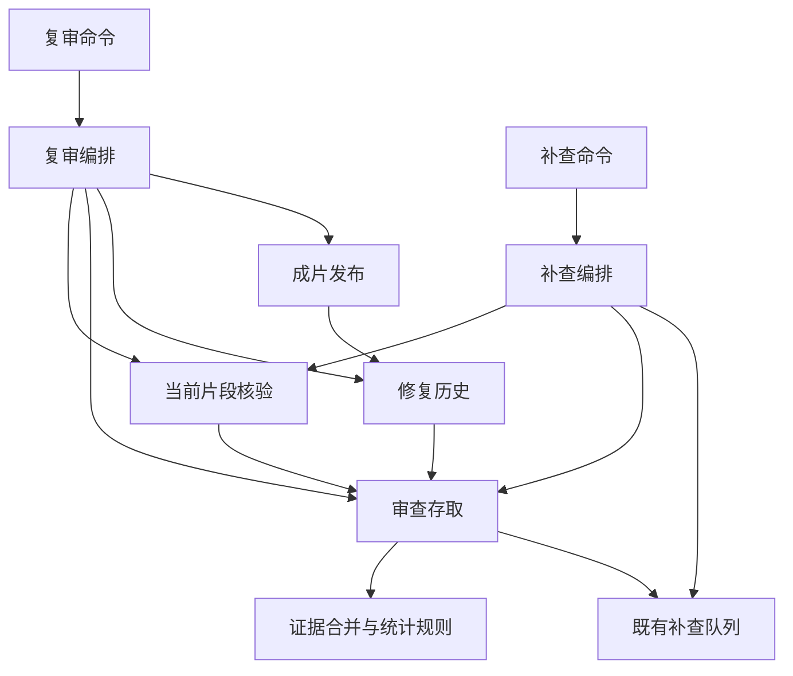

# 复审状态、补查和成片发布解耦 · 2026-09-16

本轮继续拆开复审、补查、历史记录与成片发布。保持证据优先级、派单条件、重试次数、素材版本识别、缓存、发布门槛和文件写入顺序；没有修改历史数据或启动生成。

## 职责与依赖

| 模块 | 唯一职责 |
|---|---|
| `review/reconciliation.py` | 根据明确提供的计划、当前素材和证据，合并判词、确认 Flash 候选、选出待审片段、汇总统计；无文件读取、模型调用和调度。 |
| `scripts/review_store_thin.py` | 读取当前素材与 JSONL/补查证据，调用合并规则，保存整集审查报告；补查部分更新保留其他通道的原结论并备份原报告。 |
| `review/audit_queue.py` | 原有 SQLite 补查队列的初始化、领取、完成、查询和异常恢复；原表结构与事务不变。 |
| `scripts/verify_clips_thin.py` | 原模型核验及 CurrentVerifier，保留提示词、请求参数与当前素材选择。 |
| `scripts/repair_review_flow_thin.py` | 一轮复审的工作编排：读取证据、核验、保存记录、重新合并、观察历史、尝试发布。 |
| `scripts/audit_flow_thin.py` | 补查占用检查、核验前后素材确认、原重试与停止规则；不依赖复审命令或批量调度器。 |
| `scripts/repair_history.py` | 修复试验、原素材归档、当前素材观察和真实生成记录；不再负责成片发布。 |
| `scripts/repair_delivery_thin.py` | 候选成片目录、发布条件、旧片备份、替换、收据及发布后报告写回。 |
| `util.read_json / load_dotenv` | 原 JSON 读取与环境加载语义；不再为了工具函数导入整套批量流程。 |

命令 `repair_review_thin.py` 和 `shared_audit_thin.py` 保留原参数、退出码及调用方式，分别缩为 28、25 行。Python 调用方改为直接导入职责模块，不提供旧 helper 的兼容入口。

以前的三组相互导入已解除：历史↔复审、补查↔复审、批量工具↔复审。共享规则和队列不导入执行器；读取状态不会顺带创建判官或启动任务。

## 验证

1. 在 `bf20493` 冻结 14 组输入与输出，包括：原素材精判通过、旧素材不能放行新片、一般补查不覆盖已有精判、联合补查、Flash 等待确认、原文终裁、技术错误、旧终裁迁入、过期片段和无素材。整理后的完整报告、待审范围和统计与冻结结果一致；重复处理不改变结果，不修改输入。
2. 复用并发领取测试：Qwen/Flash 共用原队列，每项只被领取一次；仅回收失去进程的在途任务，保留已完成结果。
3. 模拟补查成功、一次失败后通过、两次失败记异常、核验前/后素材换版、停止时完成在途而保留待办。次数、退出码和状态保持原样。
4. 修复拥有的章节不会被补查写回；只审 H3 的运行保留 SD 旧结论；重复补查不覆盖最初备份。
5. 集成验证“审查报告写回 → 历史观察 → 发布”，以及“旧片备份 → 发布收据 → 替换成片 → 媒体报告”的原顺序。复审不新增生成记录；重复运行复用同一素材结论，不再请求模型。
6. 原发布回归继续覆盖：技术/内容/版本不合格不替换旧片；替换后报告写入中断时，候选和旧片备份仍在，下一次能完成同一次发布。
7. 模型使用模拟返回，没有调用真实模型或视频服务。独立导出的实际提交版本 824 项通过，保留其他本地改动的工作树 826 项通过，包含上一轮请求冻结和已有 FFmpeg 回归。

冻结案例位于 `tests/review_reconciliation_cases.py` 与 `tests/fixtures/review_reconciliation_before.json`。新增的补查执行、复审到发布和依赖方向回归在 `test_audit_flow.py`、`test_repair_review_flow.py`。本机验证日志保存在 `outputs/review-state-decoupling-20260916/`，不进入 Git。

## 运行边界

继续使用原 JSON、JSONL、SQLite 文件、锁、暂停标记和发布收据。没有新队列、数据迁移、历史清理或生成次数重置。诸天继续暂停，不自动恢复规划、审查或重拍。

原整集审查入口和专门复审流程仍有不同用途，本轮没有将两者强行合并；规划器、主调度器和判官请求本身的后续拆分另做。
