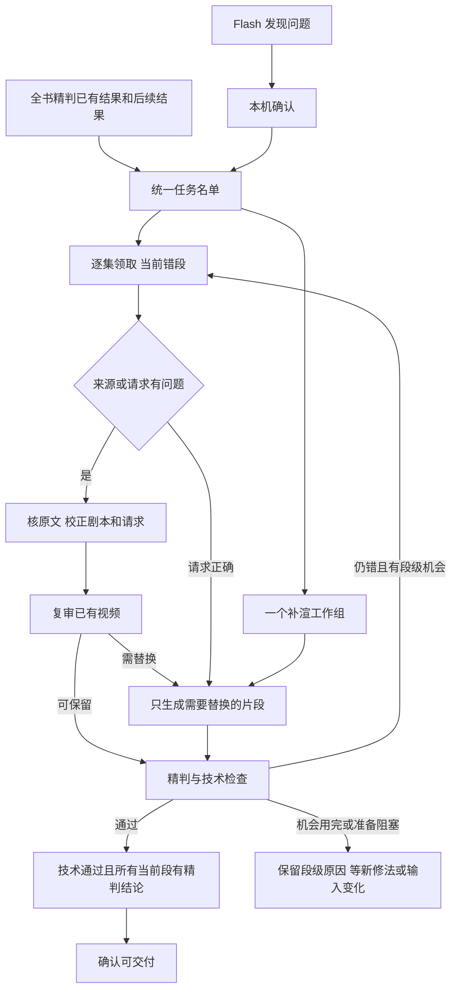

# 雾月修复总控

2026-09-14 20:02 起，生产修复统一由 `scripts/manage_repair_thin.py` 管理。
当前源代码位于 `/mnt/disk1/zengzhitao/novel-manga-video` 的 `feat/fast-tier` 工作树。

2026-09-15 15:54：原文复核、最终请求检查和段级有效尝试预算已接入普通修复入口，详见 [修复主线接入](managed-repair-integration-20260915.md)。历史整集轮次保留，新错段不再受旧整集轮次阻挡。

2026-09-15 更新：新任务已经改为单集推进，并接入生成前准入。每集的阻挡原因写入 `render_readiness.json`，总控维护 `plan_queue`，输入修好后续跑。详见 `docs/readiness-and-episode-dispatch-20260915.md`。

同日后续更新：修复记录进入 `repair_history/`；重生成片先写 `repair_candidate/`，当前视频全部过审后再发布。明确的演员身份和翻译编号在编译时保留。历史加主动镜头重构的小试未显示节省，未全量开启。详见 `docs/repair-history-and-publication-final-20260915.md`。

**主检查是 Qwen 全书精判；Flash 只做并行补漏。第二遍不再等待 Flash 全书扫描结束。**

2026-09-15 增加三类停止任务的自动恢复：分镜解堵、技术修复、两轮后残留。
由同一总控派单、共用并发限制，详见 [恢复入口及验证](recovery-queue-20260915.md)。

## 一个入口管理什么

总控维护统一任务归属和每一步的进度，继续调用现有修段、渲染、提示词和精判代码。



- 新修复任务每单 **1 集**，最多 24 集可执行在途；在途旧批次完成当前步骤后再拆为单集后继，保留轮次与结果。
- 补渲生成最多 12 集，生成加复审总占用最多 24 集；完成一集即可转入复审，不等待其他集。
- 所有步骤使用同一份归属记录，仍在复审的集也不能被其他工作组重复领取。
- 原 A/B 是两组同类型工人，已不再各自管理待办和完成名单。
- 三次准备入口统一按当前错段选修法：归属争议先核原文，请求正确的生成问题重拍，同类问题连续出现则换镜头表达。保留原文对应、已有分镜切分和无变化片段的缓存。
- fast 每人只使用主角色卡，旧表情卡引用在实际渲染前统一整理；不再补表情卡。
- `repair_review_thin.py` 复用已有精判结果。以当前成片选中的片段视频及原有 take 标识匹配，旧视频的结论不能清除新视频的问题。
- 复审后不再另跑一个独立精判门。Flash 只提出候选，由本机明确确认一次后才变更最终结论。
- 第二遍等待 Qwen 主检查、主检查缺口补审及第一遍修复/补渲收尾。Flash 扫描和补漏确认可跨轮继续，不挡主流程。
- 第二遍期间首次进入修复的章节，从自己的第一轮开始计数；不能因全书已经进入第二遍，就直接记成两轮都修过。
- 旧整集轮次只保留作历史记录。新入口每段最多再生成 3 个实际版本；缓存复用和准备失败不计入，新发现错段单独获得机会。仍未过关的片段保留原因，不无限重拍或自动放行。
- 黑屏等明确技术必修保留；静音按现有配置豁免；不放宽观众一眼看得出的错误标准。

## 工单如何形成

每轮从当前视频对应的审查结果读取，不按“进程跑过”认定修复成功。

| 来源 | 进入队列前的处理 | 形成的任务 |
|---|---|---|
| Qwen 全书精判或重渲后复审发现明显错误 | 当前视频匹配到精判结论和修正指令 | 修复任务；已确认的结果复用 |
| 旧判官保留的必修候选 | 先精判，误报清掉，真错留下 | 确认后才修分镜/重拍 |
| Flash 发现可疑问题 | 由本机确认，不直接按 Flash 标记重拍 | 确认后加入同一待修名单 |
| 计划/指令已改，成片尚未更新 | 检查实际成片状态和重试额度 | 补渲任务 |
| 新视频还没有精判结论 | 不沿用旧视频的判定 | 复审或补审任务 |

具体修复依据由片段号、原文段落、身份账本、当前分镜、画面证据和修正指令组成。
修段器只改目标片段的分镜，再更新 H3 提示词；实际生成请求携带主角色卡、场景和已有参考声音，按资源池空位派发。
当前普通修复由 `managed_repair_thin.py` 统一处理：复用原文核验与诊断组件，先处理来源和请求问题，再选择保留素材、只重拍或改镜头。最终按实际素材复审和技术门认定成功。

9 月 14 日先实现补渲和前批复审交错、60 集批次缩为 12 集；9 月 15 日进一步改为每集独立推进。该改变缩短流程等待，不代表单次视频生成成功率已经提升。

## 此次接续了哪些进度

- 导入旧 A/B 的 **300 集本轮已处理记录**。这个数是处理过，不是 300 集全部合格。
- 两批各 60 集的修复渲染、一批 12 集的补渲，以及本机和 Flash 的两路全书检查保留原进程继续完成。
- 旧 A/B、补渲、第二遍等待器、两路全书检查外层调度已停止；它们不会再自行发新任务。
- 仍在跑的旧全书检查进程只是被接续的子任务，其已写出的 JSONL 结果持续导入总控。
- 独立精判门停止，已落盘的有效结果保留。旧 `.state` 复制到新状态目录；原日志留作历史。
- 第 1679、2017 集的单主卡恢复在切换前已完成其流程，后续是否仍有必修由统一名单决定。
- 首批由新总控发出的 Flash 本机确认已完成 **22 段**，成功写回同一份逐集审查结论。

交接的具体 PID、原任务参数和批次名单保存在 `outputs/wuyue/repair_manager/legacy_handoff.json`。

## 日常只使用这些命令

在项目目录 `/mnt/disk1/zengzhitao/novel-manga-video` 运行：

```bash
# 状态：工作组正在做什么、待精判、必修和技术阻挡
.venv/bin/python scripts/manage_repair_thin.py status --novel-dir outputs/wuyue

# 当前成片的精判覆盖和互不重叠的集数分类；同时保存逐集清单
.venv/bin/python scripts/manage_repair_thin.py progress --novel-dir outputs/wuyue

# 暂停发新任务；已经发出的当前步骤继续完成
.venv/bin/python scripts/manage_repair_thin.py pause --novel-dir outputs/wuyue

# 总控还在运行时继续调度
.venv/bin/python scripts/manage_repair_thin.py resume --novel-dir outputs/wuyue

# 总控进程意外退出后，从保存的进度恢复；已有子进程继续接管
.venv/bin/python scripts/manage_repair_thin.py run --novel-dir outputs/wuyue
```

不需要重新启动旧的 `wy_repair_chain2.sh`、`wy_repair_chain2b.sh`、`wy_repair_pass2.sh`、`wy_filler.sh` 等调度入口。
首次接管使用的 `--adopt-legacy` 已记录完成，日常恢复不需要再导入。

## 状态怎么看

- `state.json`：唯一的调度状态，记录任务归属、当前步骤、进程、完成的轮次和失败次数。
- `manager.log`：总控调度事件。
- `job-xxxxx-stepNN.log`：每个任务、每个步骤的日志。
- `verified.jsonl`：新总控精判结果；现有 `tmp/fix/wy_verify*.jsonl` 是继承的证据输入。
- `delivery.log`：定期刷新原看板交付统计的记录。
- `inspection_progress.json`：运行 `progress` 时保存的检查快照和逐集清单，记录通过、已确认错误、未查的片段数。

所有新状态都在 `/mnt/disk1/zengzhitao/novel-manga-video/outputs/wuyue/repair_manager/`，不进入 Git。

`deliverable_precise` 表示技术通过、当前每段都已有精判结论、没有必修且没有待确认的 Flash 候选。
全书检查未结束时，它会小于历史看板的“可交付”（历史看板允许还没被全书精判覆盖的普通通过段）。
这部分差额应理解为**待确认**，不能说成视频突然变坏或成片被删除。

`progress` 的集数按以下顺序分为互斥类别，总和等于全书集数：

1. 尚有未精判片段 → 尚未查完整集（其中可以已发现部分真错）。
2. 全部片段已查、仍有明确错误 → 已查完待修。
3. 全部片段已查、无明确画面错误，但成片需更新或技术检查未过 → 技术收尾。
4. 上述都通过，只有新出现的 Flash 候选待确认 → 补漏确认。
5. 全部通过 → 当前成片完整过关。

片段口径的“已通过＋已确认错误＋未查”同样互斥。旧判官的未确认必修候选计入未查，不当作已确认真错。
核对时发现 49 段旧记录同时保留了“首次精判有错”和“终审通过”；它们均有同一当前视频的终审原始证据。
已把这些记录统一成有效终审结论，避免统计重新把已撤销的错误算入待修。这是记录归一，不是又重渲修好了 49 段。
新视频不能沿用旧 take 的检查结论；因此“未查”也包含重渲后等待复审的片段，不只是从没碰过的章节。
`processed_episodes_now_passed` 是有已完成处理轮次记录、现在又全部过关的交集，不是因果归因的净修复数。

当主检查和可执行修复已经收尾、只有 Flash 补漏还在继续时，总控显示 `monitoring_flash`。
这表示主修复已收尾后继续监测补漏，不是等待 Flash 才允许启动第二遍；新确认的问题仍按修复次数进入队列或残留名单。

任务进程退出只表示该步骤结束。整集的最终状态仍从实际视频、审查和精判记录读取。
基础设施步骤连续失败三次会停在原步骤并显示 `held`；技术补渲重复失败同样有界保留。
两轮修复结束仍有错时显示 `needs_attention` 和残留名单，不自动降标准或假报完成。

## 验证

- 最新派单与进度统计调整的相关回归 **75 项通过**，覆盖在途大批次保留、新批次缩小、补渲/复审交错与排队上限、逐段精判口径、互斥集数分类、旧终审结论归一，以及既有接管、断点、缓存和单主卡行为。
- 接管后实际进程与状态已核对；两个旧全书检查 PID 继续工作，旧调度入口退出，新总控已完成第一批真实确认。
- 已现场验证暂停发新任务、保留在途检查和恢复调度；当前处于运行状态。
- 全书修复仍在进行；代码和文档本轮尚未提交或推送。
